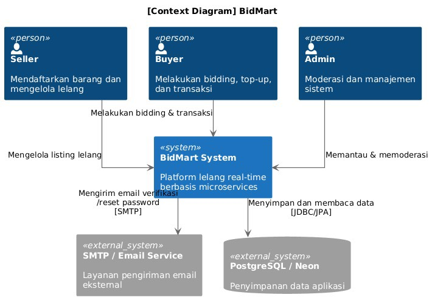
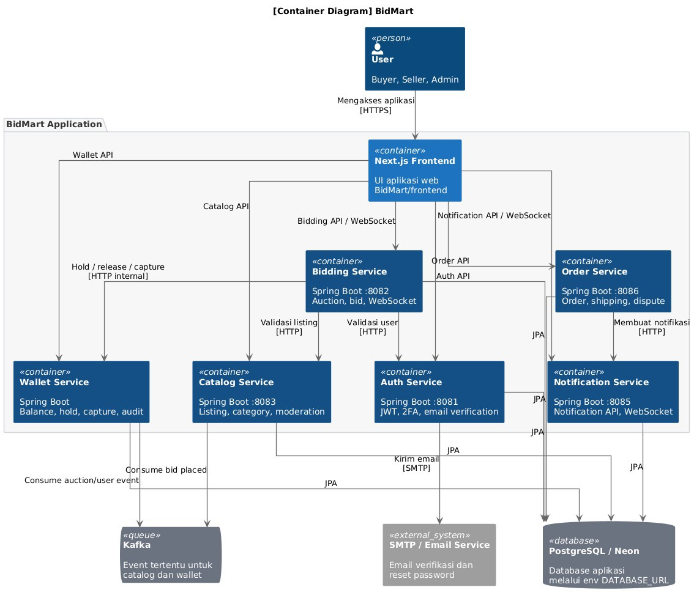
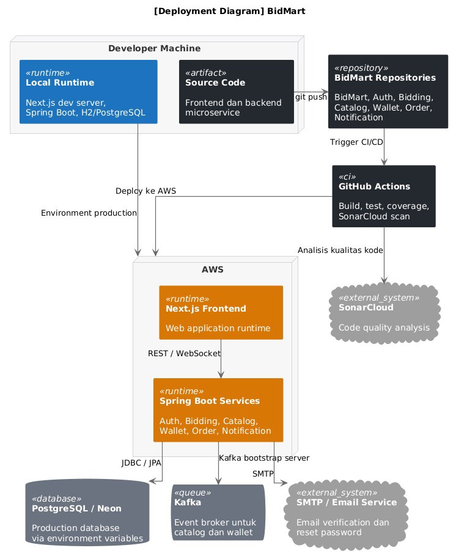
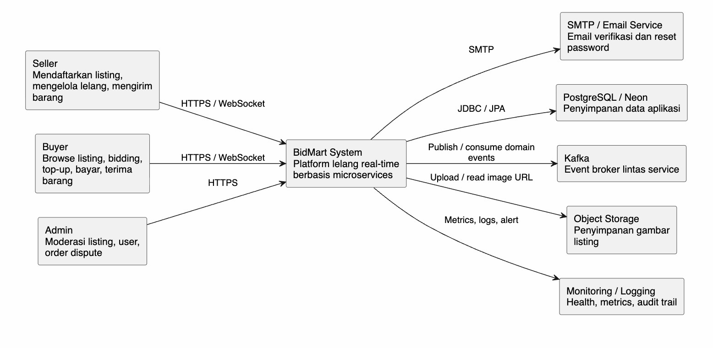
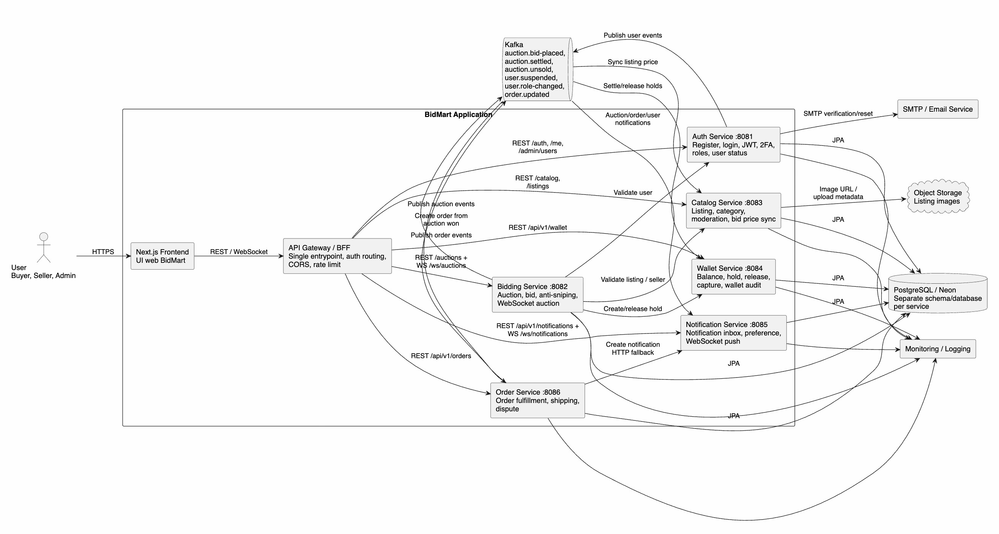
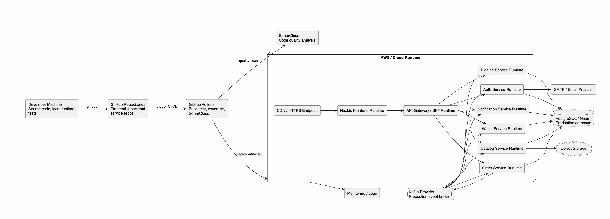
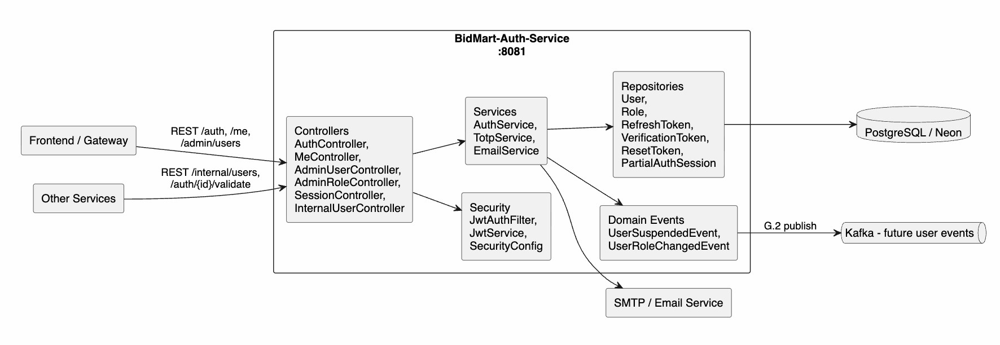
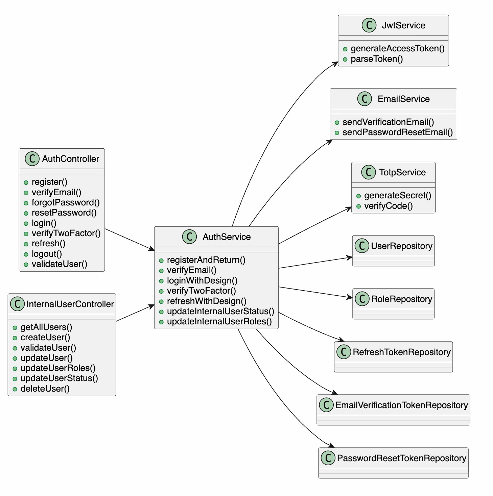
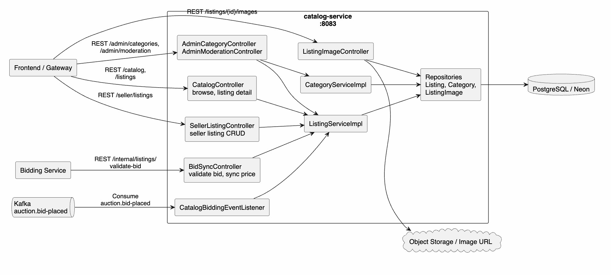
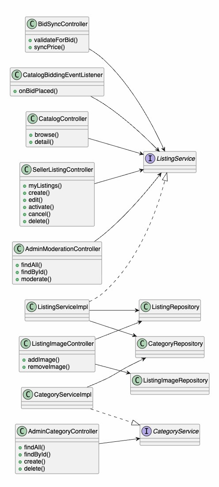

# Bidmart Software Architecture

# Kelompok B-02

## Daftar Anggota

| NPM          | Nama                                   |
|--------------|----------------------------------------|
| 2306275941   | Ahmad Aqeel Saniy                      |
| 2406347424   | Bermulya Anugrah Putra                 |
| 2406355445   | Jessica Tandra                         |
| 2406356643   | Lessyarta Kamali Sopamena Pirade       |
| 2406407796   | Naila Khadijah                         |

## Current Architecture

### 1. Context Diagram
 

 
Context Diagram BidMart menggambarkan sistem secara keseluruhan dari sudut pandang paling tinggi (Level 1 C4 Model). Diagram ini menunjukkan siapa saja yang berinteraksi dengan sistem BidMart dan sistem eksternal apa saja yang terlibat.
 
**Aktor (Person):**
 
| Aktor  | Peran |
|--------|-------|
| **Seller** | Mendaftarkan barang dan mengelola listing lelang di dalam sistem BidMart. |
| **Buyer** | Melakukan bidding, top-up saldo, dan menyelesaikan transaksi pembelian. |
| **Admin** | Memantau aktivitas platform dan melakukan moderasi konten serta manajemen sistem. |
 
**Sistem Eksternal:**
 
| Sistem Eksternal | Interaksi |
|------------------|-----------|
| **SMTP / Email Service** | Menerima permintaan dari BidMart System untuk mengirimkan email verifikasi akun dan reset password kepada pengguna. Komunikasi menggunakan protokol SMTP. |
| **PostgreSQL / Neon** | Digunakan sebagai penyimpanan data utama aplikasi. BidMart System membaca dan menulis data melalui JDBC/JPA. |
 
**Alur Utama:**
- Seller berinteraksi dengan BidMart System untuk mengelola listing lelang.
- Buyer berinteraksi dengan BidMart System untuk melakukan bidding dan transaksi.
- Admin berinteraksi dengan BidMart System untuk memantau dan memoderasi platform.
- BidMart System mengirimkan notifikasi email melalui SMTP / Email Service.
- BidMart System menyimpan dan membaca seluruh data aplikasi ke PostgreSQL / Neon.
---
 
### 2. Container Diagram
 

 
 
Container Diagram BidMart menggambarkan arsitektur internal sistem pada Level 2 C4 Model. Diagram ini memperlihatkan semua container (aplikasi yang dapat berjalan secara independen) yang membentuk BidMart Application, beserta cara masing-masing container berkomunikasi satu sama lain.
 
**Daftar Container:**
 
| Container | Teknologi | Tanggung Jawab |
|-----------|-----------|----------------|
| **Next.js Frontend** | Next.js | UI aplikasi web BidMart yang diakses pengguna melalui HTTPS. Menjadi titik masuk utama bagi Buyer, Seller, dan Admin. |
| **Auth Service** | Spring Boot :8081 | Menangani registrasi, login, JWT, 2FA, dan verifikasi email pengguna. |
| **Bidding Service** | Spring Boot :8082 | Mengelola sesi lelang, proses bidding, dan komunikasi real-time melalui WebSocket. |
| **Catalog Service** | Spring Boot :8083 | Mengelola listing barang, kategori, dan moderasi konten. |
| **Wallet Service** | Spring Boot (port dinamis) | Mengelola saldo pengguna, operasi hold, capture, release, dan audit transaksi keuangan. |
| **Order Service** | Spring Boot :8086 | Menangani proses fulfillment order, pengiriman, dan penyelesaian sengketa. |
| **Notification Service** | Spring Boot :8085 | Mengirimkan notifikasi kepada pengguna melalui WebSocket push maupun API. |
 
**Sistem Eksternal yang Terhubung:**
 
| Sistem | Peran |
|--------|-------|
| **Kafka** | Message broker yang menerima dan mendistribusikan event seperti `bid-placed` dan `auction/user event` antara Bidding Service, Catalog Service, dan Wallet Service secara asinkron. |
| **SMTP / Email Service** | Menerima permintaan dari Auth Service untuk mengirimkan email verifikasi dan reset password. |
| **PostgreSQL / Neon** | Database utama yang diakses oleh semua service menggunakan JPA untuk menyimpan data aplikasi. |
 
**Alur Komunikasi Utama:**
- User mengakses aplikasi melalui **Next.js Frontend** via HTTPS.
- Frontend berkomunikasi ke **Bidding Service** melalui Bidding API / WebSocket untuk fitur lelang real-time.
- Frontend berkomunikasi ke **Notification Service** melalui Notification API / WebSocket untuk notifikasi langsung.
- Frontend mengakses **Catalog Service** melalui Catalog API dan **Wallet Service** melalui Wallet API.
- **Bidding Service** memvalidasi listing ke Catalog Service (HTTP) dan memvalidasi user ke Auth Service (HTTP).
- **Bidding Service** berkomunikasi ke **Order Service** melalui Order API dan Auth API.
- **Order Service** membuat notifikasi ke **Notification Service** melalui HTTP.
- **Wallet Service** dan **Catalog Service** mengonsumsi event dari **Kafka**.
- Semua service menyimpan data ke **PostgreSQL / Neon** menggunakan JPA.
---
 
### Deployment Diagram
 

Deployment Diagram BidMart menggambarkan bagaimana seluruh komponen sistem di-deploy ke infrastruktur nyata, mulai dari mesin pengembang hingga lingkungan produksi di AWS.
 
**Lingkungan Developer Machine:**
 
| Komponen | Keterangan |
|----------|------------|
| **Source Code** | Kode sumber frontend dan semua backend microservice yang dikerjakan oleh developer. |
| **Local Runtime** | Lingkungan lokal untuk menjalankan Next.js dev server, Spring Boot, H2/PostgreSQL saat pengembangan. |
 
**Alur CI/CD:**
 
1. Developer melakukan `git push` ke **BidMart Repositories** (GitHub), yang terdiri dari repository: BidMart, Auth, Bidding, Catalog, Wallet, Order, dan Notification.
2. Push ke repository memicu **GitHub Actions** yang menjalankan proses build, test, coverage, dan SonarCloud scan.
3. Hasil analisis kualitas kode dikirimkan ke **SonarCloud** sebagai external system pemantau kualitas kode.
4. Artifact hasil build di-deploy ke lingkungan produksi di **AWS**.
**Lingkungan Produksi (AWS):**
 
| Komponen | Keterangan |
|----------|------------|
| **Next.js Frontend** | Runtime aplikasi web yang melayani request pengguna melalui HTTPS. Berkomunikasi ke backend melalui REST / WebSocket. |
| **Spring Boot Services** | Semua microservice (Auth, Bidding, Catalog, Wallet, Order, Notification) berjalan sebagai runtime di AWS. |
| **PostgreSQL / Neon** | Database produksi yang dikonfigurasi melalui environment variable `DATABASE_URL`. |
| **Kafka** | Event broker produksi untuk mendistribusikan event antara Bidding Service, Catalog Service, dan Wallet Service. Terhubung ke Spring Boot Services melalui Kafka bootstrap server. |
| **SMTP / Email Service** | Layanan eksternal untuk pengiriman email verifikasi dan reset password dari Auth Service. |
 
**Alur Deployment Produksi:**
- Spring Boot Services berkomunikasi ke PostgreSQL / Neon melalui JDBC/JPA.
- Spring Boot Services terhubung ke Kafka melalui Kafka bootstrap server.
- Spring Boot Services mengirimkan email melalui SMTP ke Email Service.
- Next.js Frontend berkomunikasi ke semua Spring Boot Services melalui REST dan WebSocket.

## Future Architecture

**Ringkasan**:
Arsitektur G.2 memperbaiki beberapa risiko dari arsitektur awal:

1) Frontend saat ini memakai satu `NEXT_PUBLIC_API_BASE_URL`, sedangkan backend sudah dipisah menjadi banyak service. Tanpa gateway, frontend harus tahu semua alamat service dan integrasi mudah rusak saat deployment. Karena itu G.2 menambahkan API Gateway/BFF sebagai satu pintu masuk untuk REST dan WebSocket.

2) Komunikasi event masih belum konsisten. Bidding memakai Spring application event untuk `BidPlacedEvent`, `WinnerDeterminedEvent`, dan `AuctionUnsoldEvent`, sementara Catalog dan Wallet sudah menunggu Kafka topic seperti `auction.bid-placed`, `auction.settled`, dan `auction.unsold`. Pada runtime microservice terpisah, Spring application event tidak akan menyeberang proses. Karena itu G.2 menetapkan Kafka sebagai event backbone lintas service, sedangkan Spring event hanya boleh dipakai untuk event internal dalam satu service.

3) Konfigurasi port dan internal endpoint perlu distandardisasi. Bidding memakai port `8082`, Catalog `8083`, Notification `8085`, Order `8086`, tetapi Wallet default-nya juga `8082` walaupun diagram awal menaruh Wallet di `8084`. Pada G.2 Wallet distandardisasi ke `8084`, semua internal endpoint diamankan memakai `X-Service-Token`, dan service tidak diakses langsung oleh user.

### Future Context Diagram

**Penjelasan:** Future context diagram kami menunjukkan batas sistem paling luar. Aktor utama adalah Buyer, Seller, dan Admin. Semua aktor hanya berinteraksi dengan BidMart System melalui HTTPS dan WebSocket. Database, Kafka, SMTP, object storage, dan monitoring dianggap external system karena berada di luar kode aplikasi utama tetapi dibutuhkan agar sistem berjalan.

### Future Container Diagram

**Penjelasan:** Future container diagram kami menambahkan API Gateway/BFF agar frontend tidak perlu langsung memanggil enam backend service. Gateway juga menjadi tempat konsisten untuk routing, CORS, rate limit, dan validasi JWT awal. Tiap backend tetap bertanggung jawab atas domainnya sendiri. Kafka menjadi jalur async resmi, sedangkan REST dipakai untuk query/command sinkron seperti validasi user, validasi listing, dan hold saldo.

### Future Deployment Diagram

**Penjelasan:** Future deployment diagram kami memperlihatkan alur dari developer ke repository, CI/CD, lalu runtime cloud. Semua service backend berjalan sebagai runtime terpisah. Database, Kafka, SMTP, object storage, dan observability berada sebagai managed external dependency agar backend dapat diskalakan dan dirilis secara terpisah.

## Risk Mitigation

### Mengapa Risk Storming Diterapkan
 
BidMart adalah platform lelang real-time berbasis microservices. Ketika platform ini sukses dan digunakan oleh ribuan pengguna secara bersamaan, arsitektur awal yang cukup untuk tahap pengembangan akan menghadapi tekanan yang serius. Risk storming diterapkan karena tidak ada satu pun anggota tim yang dapat menilai risiko seluruh sistem sendirian setiap service memiliki karakteristik risiko yang berbeda, dan tanpa evaluasi kolaboratif, risiko tersembunyi baru teridentifikasi ketika sudah berada di lingkungan produksi.
 
---
 
### Risk Assessment: Identifikasi Risiko Utama
 
Risk matrix yang digunakan mengalikan dua dimensi: **dampak** (1=rendah, 2=sedang, 3=tinggi) dan **kemungkinan terjadi** (1=rendah, 2=sedang, 3=tinggi). Skor 1-2 = risiko rendah, 3-4 = sedang, 6-9 = tinggi.
 
#### Tabel Risk Assessment
 
| Kriteria Risiko  | Auth Service | Bidding Service | Wallet Service | Catalog Service | Order Service | Total Risiko |
|------------------|:------------:|:---------------:|:--------------:|:---------------:|:-------------:|:------------:|
| Skalabilitas     | 2            | **6**           | 3              | 4               | 2             | 17           |
| Ketersediaan     | 3            | **9**           | **9**          | 3               | 3             | 27           |
| Performa         | 2            | **9**           | **6**          | 4               | 2             | 23           |
| Keamanan         | **6**        | **6**           | **9**          | 3               | 4             | 28           |
| Integritas Data  | 3            | **6**           | **9**          | 2               | **6**         | 26           |
| **Total Risiko** | **16**       | **36**          | **36**         | **16**          | **17**        |              |
 
---
 
#### Bidding Service
 
| Kriteria        | Skor    | Alasan |
|-----------------|---------|--------|
| Ketersediaan    | 9 (3x3) | Bidding adalah inti dari platform; jika service ini down saat lelang sedang berlangsung, semua transaksi gagal. Lelang real-time tidak toleran terhadap downtime. |
| Performa        | 9 (3x3) | WebSocket harus mengirimkan pembaruan harga secara real-time ke semua peserta lelang. Di bawah beban tinggi, latensi yang meningkat menyebabkan bid dianggap tidak sah karena melewati anti-sniping window. |
| Integritas Data | 6 (3x2) | Bid yang diterima harus direkam secara atomik dan dikirimkan ke Kafka. Kehilangan event `auction.bid-placed` menyebabkan pemenang lelang tidak tercatat. |
| Keamanan        | 6 (3x2) | Tanpa API Gateway, tidak ada satu titik enforcement untuk validasi JWT ada kemungkinan bid dikirimkan dengan token yang dipalsukan. |
 
---
 
#### Wallet Service
 
| Kriteria        | Skor    | Alasan |
|-----------------|---------|--------|
| Keamanan        | 9 (3x3) | Dana pengguna disimpan dan dikelola di sini. Akses tidak sah ke API hold/capture berdampak finansial secara langsung. |
| Integritas Data | 9 (3x3) | Operasi hold-capture-release harus bersifat idempoten. Jika terjadi duplikasi akibat retry tanpa deduplication, saldo pengguna bisa terpotong dua kali. |
| Ketersediaan    | 9 (3x3) | Jika Wallet down saat auction settlement berlangsung, pemenang tidak bisa membayar dan order tidak pernah terbentuk mengakibatkan kehilangan pendapatan secara langsung. |
| Performa        | 6 (3x2) | Ketika banyak lelang selesai secara bersamaan, Wallet menerima lonjakan request `capture`. Tanpa antrian, lonjakan ini dapat menyebabkan service crash. |
 
---
 
### Current Architecture
#### Database Bersama
 
Semua service (Auth, Bidding, Catalog, Wallet, Order, Notification) menggunakan satu instance PostgreSQL/Neon yang sama. Kondisi ini menciptakan dua masalah utama:
 
- **Single point of failure untuk ketersediaan** jika database down, semua service gagal secara bersamaan.
- **Risiko integritas data lintas service** schema yang terlalu berdekatan memungkinkan query dari satu service secara tidak sengaja mempengaruhi tabel milik service lain.
---
 
#### Tidak Ada API Gateway
 
Frontend Next.js memanggil masing-masing service secara langsung. Kondisi ini berarti:
 
- Tidak ada enforcement CORS dan rate limiting secara terpusat.
- Validasi JWT diimplementasikan secara duplikat di masing-masing service.
- Tidak ada satu titik masuk untuk memblokir traffic berbahaya sebelum mencapai service manapun.
---
 
#### Kafka: Single Broker
 
Kafka digunakan untuk event `auction.bid-placed`, `auction.settled`, dan `wallet.hold`. Jika satu-satunya broker ini crash, event tidak terkirim dan sistem kehilangan konsistensi data antarservice.
 
---
 
### Mitigasi Risiko dan Justifikasi Perubahan Arsitektur
 
#### Penambahan API Gateway / BFF
 
**Risiko yang dimitigasi:** Keamanan pada Auth Service (6) dan Bidding Service (6); tidak adanya rate limiting.
 
API Gateway / BFF ditambahkan sebagai single entrypoint untuk semua request yang berasal dari frontend. Gateway ini menangani auth routing terpusat, validasi JWT, CORS policy, dan rate limiting. Dengan adanya komponen ini, masing-masing service tidak perlu lagi mengimplementasikan validasi token secara duplikat. Serangan brute-force juga dapat diblokir di satu titik sebelum sempat mencapai service manapun.
 
---
 
#### Separate Schema per Service di PostgreSQL
 
**Risiko yang dimitigasi:** Ketersediaan 9 (database bersama sebagai single point of failure) dan integritas data lintas service.
 
Database dipecah menjadi schema yang terisolasi per service: `auth_db`, `bidding_db`, `wallet_db`, `catalog_db`, `order_db`, dan `notif_db`. Pendekatan ini memastikan bahwa masalah pada satu schema tidak mengakibatkan cascade failure ke service lain. Selain itu, isolasi schema mencegah query antarservice yang tidak diinginkan, sehingga integritas data masing-masing domain tetap terjaga.
 
---
 
#### Kafka Cluster dengan Replication Factor 3
 
**Risiko yang dimitigasi:** Integritas data pada Bidding Service (6) dan Wallet Service (6) akibat kehilangan event.
 
Kafka dikonfigurasi sebagai cluster dengan minimal 3 broker dan replication factor 3. Konfigurasi ini memastikan bahwa apabila satu broker crash, event `auction.bid-placed`, `auction.settled`, dan `wallet.hold` tetap tersedia di broker lain. Tanpa mitigasi ini, kehilangan event Kafka berarti pemenang lelang tidak tercatat dan proses settlement tidak pernah terjadi sebuah skenario yang berdampak finansial serius bagi pengguna dan platform.
 
---
 
#### CDN / HTTPS Endpoint
 
**Risiko yang dimitigasi:** Ketersediaan dan performa pada Bidding Service dan Auth Service.
 
CDN ditambahkan di depan Next.js Frontend untuk mendistribusikan beban traffic dan mengurangi latensi bagi pengguna yang tersebar secara geografis. CDN juga meningkatkan ketersediaan frontend karena static assets dapat di-cache meskipun origin server sedang mengalami beban tinggi.
 
---
 
#### Monitoring / Logging dan Object Storage
 
**Risiko yang dimitigasi:** Observabilitas untuk semua service mendukung deteksi dini sebelum ketersediaan atau integritas data terdampak.
 
Monitoring terpusat dan centralized logging ditambahkan untuk memantau health, metrics, dan audit trail seluruh service. Object storage digunakan khusus untuk menyimpan gambar listing pada Catalog Service, sehingga beban penyimpanan data biner tidak membebani database relasional.
 
---
 
### Ringkasan
 
| Komponen            | Sebelum (Current Architecture)              | Sesudah (Future Architecture)        |
|---------------------|--------------------------------------------|----------------------------------------|
| Titik masuk         | Frontend langsung ke masing-masing service | API Gateway / BFF                      |
| Database            | Satu instance bersama                      | Schema terpisah per service            |
| Kafka               | Single broker                              | Cluster 3 broker, replication factor 3 |
| Pengiriman frontend | Langsung dari origin server                | CDN / HTTPS endpoint                   |
| Observabilitas      | Tidak ada                                  | Monitoring + Logging terpusat          |
| Penyimpanan file    | Di database atau tidak terstruktur         | Object Storage                         |
 
Risk storming memungkinkan tim mengidentifikasi bahwa **Bidding Service** dan **Wallet Service** adalah titik paling kritis dalam sistem bukan karena kompleksitasnya, melainkan karena dampak langsungnya terhadap pengguna, yaitu dana dan transaksi real-time. Perubahan arsitektur yang dihasilkan bukan hanya mengurangi risiko teknis secara signifikan, tetapi juga membentuk fondasi yang lebih kokoh untuk mendukung skala yang lebih besar seiring pertumbuhan BidMart.

## Pekerjaan Individu

### Lessyarta Kamali Sopamena Pirade (2406356643)

**Deskripsi singkat kontribusi individu (1-2 kalimat):** Saya bertanggung jawab atas pengembangan modul Authentication, termasuk fitur registrasi, login, verifikasi email, reset password, JWT, refresh token, two-factor authentication, manajemen role, dan validasi user. Modul ini menjadi pusat autentikasi dan otorisasi dasar yang digunakan oleh service lain di BidMart.

#### Component Diagram Auth Module

#### Code Diagram Auth Module

**Penjelasan:** Auth module mengelola identitas user, login, JWT, refresh token, verifikasi email, reset password, 2FA, role, dan status user. Modul lain memakai Auth untuk validasi user dan authorization context.

**Keterangan Code Diagram Auth:** Code diagram Auth memperlihatkan struktur utama modul Authentication. `AuthController` menjadi entry point untuk operasi user-facing seperti register, login, verifikasi email, reset password, 2FA, refresh token, logout, dan validasi user legacy. `InternalUserController` menjadi entry point internal untuk service lain atau admin process yang perlu membaca, membuat, mengubah, memvalidasi, atau menghapus data user. Kedua controller tersebut tidak langsung mengakses database, tetapi meneruskan request ke `AuthService` sebagai pusat business logic.

`AuthService` mengatur aliran data autentikasi dari request hingga persistence: data registrasi/login divalidasi, password diproses dengan hashing, token JWT dibuat melalui `JwtService`, kode 2FA diproses oleh `TotpService`, dan email verifikasi/reset dikirim lewat `EmailService`. Untuk penyimpanan, `AuthService` memakai repository seperti `UserRepository`, `RoleRepository`, `RefreshTokenRepository`, `EmailVerificationTokenRepository`, dan `PasswordResetTokenRepository`. Interface repository tersebut menjadi boundary ke database sehingga controller tetap bersih dari detail query dan persistence.

Aliran data utamanya adalah: client mengirim request ke controller, controller memanggil `AuthService`, service memvalidasi dan memproses data, service membaca/menulis entity melalui repository, lalu response dikembalikan ke client. Pada operasi tertentu, Auth juga menghasilkan efek samping seperti mengirim email atau menerbitkan event domain, misalnya ketika status user berubah menjadi suspended atau role user berubah.

### Component Diagram Auth Module

#### Code Diagram Auth Module

